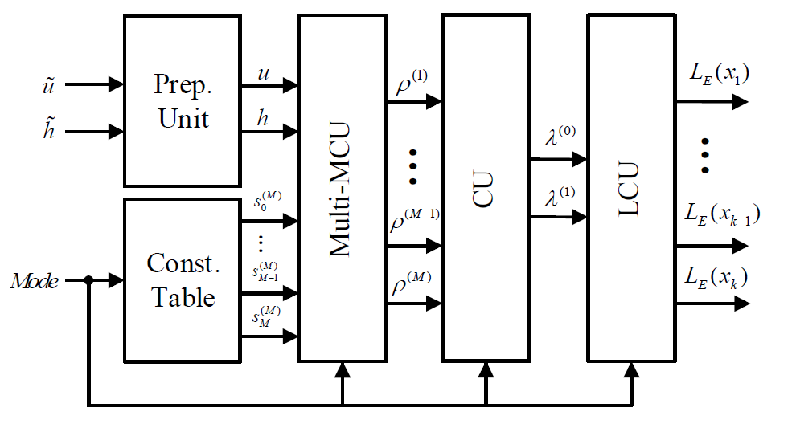
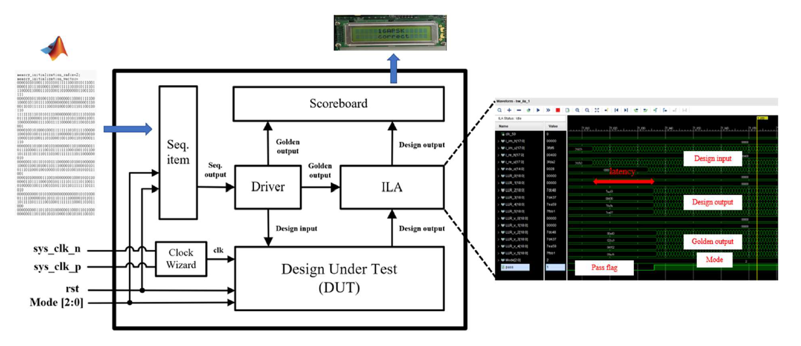
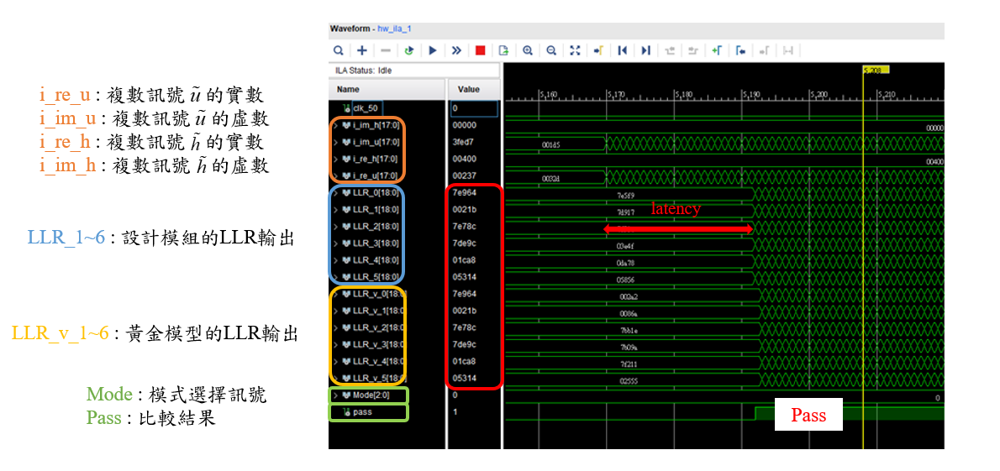

# Multi-Mode Exhaustive Search APSK Soft-Output Detector (Baseline Design)

- This project is part of the **25th Macronix Golden Silicon Award**, focusing on the design of a **multi-mode APSK demapper** for satellite communication (DVB-S2/S2X).  
- I was responsible for implementing baseline APSK demapper supporting QPSK–64APSK and conducting FPGA flow for functional verification.

### Key optimizations
📌 `Data gating` &nbsp;: &nbsp; Implemented data gating to reduce switching activity → **~47.5% power↓** 🚀 <br>
📌 `Hardware reused` &nbsp;: &nbsp; Computation sharing across multiple modes → **~24% area↓** 🚀 <br>

## ⏩ 1) Overview
- **Algorithm** &nbsp;: &nbsp; Exhaustive Search (max-log-MAP approximation)
- **Supported Modulations** &nbsp;: &nbsp; **QPSK, 8-PSK, 16-APSK, 32-APSK, 64-APSK**
- **Target Application** &nbsp;: &nbsp; DVB-S2/S2X receivers with Adaptive Coding and Modulation (ACM)

## ⏩ 2) Hardware Architecture


<p align="center">

</p>

- **Prep Unit** &nbsp;: &nbsp; CORDIC-based preprocessing (channel rotation & normalization).  
- **Constellation Table** &nbsp;: &nbsp; Provides all constellation points for **all 5 modulation modes**.  
- **Multi-MCU (Metric Computation Units)** &nbsp;: &nbsp; Computes Euclidean distance for every constellation point.  
- **Comparison Unit (CU)** &nbsp;: &nbsp; Finds the minimum distances for each bit group (0/1).  
- **LLR Calculation Unit (LCU)** &nbsp;: &nbsp; Outputs soft LLRs for LDPC decoding.  


## ⏩ 3) Implementation Flow (ASIC)
🛠 **Algorithm Simulation** &nbsp;→&nbsp; MATLAB (BER, fixed-point wordlength)  
🛠 **RTL Design & Verification** &nbsp;→&nbsp; Verilog + VCS  
🛠 **Synthesis @ 40 nm** &nbsp;→&nbsp; Synopsys Design Compiler  
🛠 **Pre-Layout Verification** &nbsp;→&nbsp; VCS (timing & power check)  


## ⏩ 4) Results Summary

| Metric                           | Result / Notes                                     |
|----------------------------------|----------------------------------------------------|
| Clock Frequency                  | 400 MHz                                            |
| Latency                          | 20 clock cycles                                    |
| Throughput                       | 0.8–2.4 Gbps                                       |
| Area                             | 481 kGE                                            |
| Power                            | 37.11 mW                                           |

---

## ⏩ 5) Repository Structure 

```
├─ alg/                  # Matlab floating-point & fixed-point simulation & pattern generation
├─ rtl/                  # Verilog design source & testbench
├─ syn/                  # Synthesis constraints (.sdc) & reports
└─ img/                  # Block diagrams, timing, waveforms
```

## ⏩ 6) Verification Flow
<p>

<p>

- **Platform** &nbsp;→&nbsp; Xilinx Virtex-7 VC707  
- **Environment** &nbsp;→&nbsp; Xilinx Vivado @ 50 MHz  
- **Golden Model** &nbsp;→&nbsp; MATLAB fixed-point simulation  
- **Verification Method**  
  - Input/output vectors generated from Golden Model  
  - DUT outputs observed with **Integrated Logic Analyzer (ILA)**  
  - Verified **all 5 modulation modes** with one full packet each (10,800–32,400 symbols).  

<p>

<p>

➡️ Verification confirmed **bit-accurate outputs across all multi-mode cases (QPSK → 64-APSK)**


